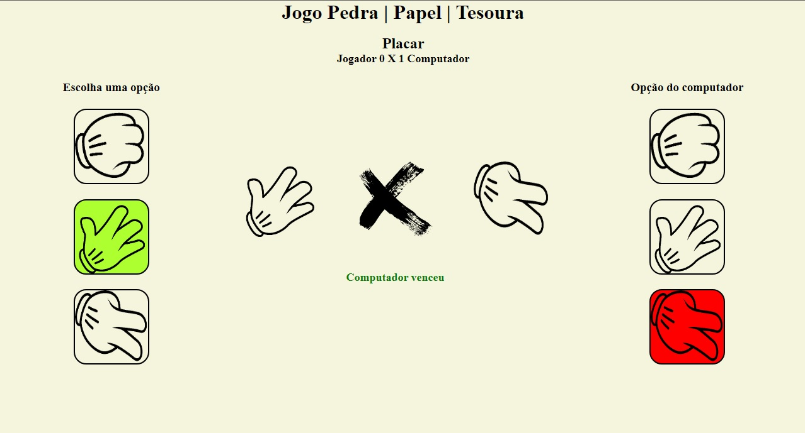

# Pedra, Papel, Tesoura

Esse jogo foi criado com o objetivo de ensinar manipulação do DOM, lógica de programação e html/css.

# Conteúdos abordados

- Organização de layouts;
- Flexbox;
- querySelector e querySelectorAll;
- forEach;
- addEventListener;
- Gerar numero aleatório (Math.floor, Math.random);
- Manipular CSS com javascript;
- Manipular texto html com javascript;
- Criar funções com parâmetros e retorno;
- Uso do if/else para definir resultado;
- Criação de um contador;
- Conversão de int para string.

# Imagens do jogo

# Link para jogar

[https://arceniosouza.github.io/JogoPedraPapelTesoura/](https://arceniosouza.github.io/JogoPedraPapelTesoura/)